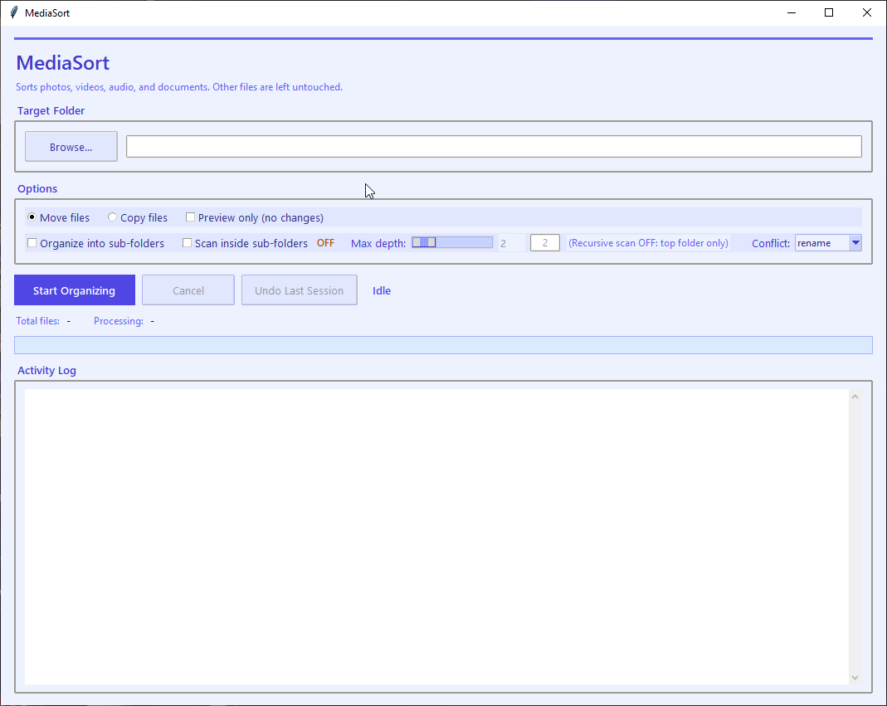

# MediaSort

A lightweight desktop file organizer for sorting Photos, Videos, Audio, and Documents safely and quickly.

Simple. Local. No dependencies.

---

## 💡 Why MediaSort?

I had an old laptop where I’d been dumping files for years — including photos and videos from my phone. Over time, everything got messy, especially since files were being split into folders by day.

I could either organize everything manually or just write a Python script.

So I wrote this(ahmm definitely not AI🤖).

MediaSort isn’t meant to be anything complicated — just a simple tool that solves a real problem.

---

## ✨ Features

- 📁 Organize files into categories:
  - `Photos`, `Videos`, `Audio`, `Documents`
- 📂 Optional subfolder organization by file type (e.g. JPEG, MP4, PDF)
- 🔄 Move or Copy mode
- 👀 Dry-run preview (see changes before applying)
- ↩️ Undo last session (safe rollback)
- 🛡️ Built-in safety checks (protected paths, conflict handling)
- ⚡ Fast and efficient (uses Python standard library only)


---

## 📸 Screenshots



---

## 🖥️ Requirements

- Python 3.10+
- Works on Windows (tested)
- Uses built-in `tkinter` (no external dependencies)

---

## ▶️ Run (Python)

```bash
python main.py
```

---

## 🧱 Build Portable EXE (Windows)

Using PyInstaller:

```bash
pyinstaller --noconfirm --onefile --windowed --name "MediaSort" main.py
```

Output:

```
dist/MediaSort.exe
```

---

## ⚠️ Important Notes

- Unsupported file types are ignored
- When using **Move mode**, files are relocated — use **Dry Run first** if unsure
- Undo is only available for the most recent session
- Always test on a sample folder before organizing important files


## 📂 Project Structure

```
main.py                  # GUI + application logic
organizer_core_lite.py  # Core file sorting logic
```

---

## 🛡️ Safety

- Prevents operations in protected system directories
- Avoids symlink-related risks
- Validates paths before file operations
- Handles file name conflicts safely

---

## 🤝 Contributing

This project does what I needed it to do, so I’m not planning to continue working on it.

If you want to add features or improve it, feel free to fork it and take it further.

---

## 📄 License

This project is licensed under the MIT License — feel free to use, modify, and distribute it however you want.